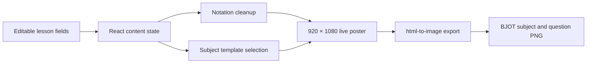

# BJOT Board Template Renderer

A browser-based editor that turns structured UTME questions, solutions, and revision notes into consistent BJOT-branded PNG lesson cards.

## Problem

Creating educational social-media cards manually is repetitive and makes branding inconsistent. Every card needs the same dimensions, typography, answer treatment, revision prompts, contact details, and subject-specific visual style. Long mathematical or scientific content also needs basic notation cleanup before it can be placed inside a fixed poster layout.

This renderer provides editable fields, a live preview, automatic science/arts template selection, and one-click PNG export.

## Intended users

- BJOT content editors preparing UTME revision material;
- tutors converting questions and worked solutions into shareable cards;
- social-media operators who need consistent branded educational graphics.

## Input to output

1. The editor starts with a complete synthetic Chemistry example.
2. The user edits the exam title, subject, question number, question, options, answer, solution, key point, exam tip, and common mistake.
3. React state updates the fixed 920 × 1080 live preview immediately.
4. The subject name selects either the science or arts visual template.
5. A small normalization layer converts common LaTeX-like notation and unsupported glyphs into readable text.
6. `html-to-image` renders the poster element at 2× pixel density and downloads a PNG.



## Architecture

| Area | Responsibility |
| --- | --- |
| `app/page.tsx` | Editor state, field groups, subject classification, notation cleanup, poster composition, and PNG download |
| `app/globals.css` | Application shell, editing controls, and preview stage |
| `app/template2.css` | Science-template poster styling |
| `app/arts.css` | Arts-template poster styling |
| `public/` | Template art, branding references, favicon, and social preview |
| `vite.config.ts` | Vinext, OpenAI Sites, and Cloudflare/Vite build configuration |

## Technologies

- React 19
- Next.js 16 application structure
- TypeScript 5
- Vinext and Vite 8
- `html-to-image`
- Cloudflare Vite plugin and Wrangler
- ESLint 9
- CSS-based fixed-canvas templates

## Run locally

Requirements:

- Node.js 22.13 or newer
- npm

```bash
npm ci
npm run dev
```

Open [http://localhost:3000](http://localhost:3000).

To validate a production build:

```bash
npm run lint
npm run build
npm run start
```

The current application does not require API credentials or a backend database.

## Usage

1. Use the **Question** tab for the exam label, subject, question, answer choices, and final answer.
2. Use the **Solution** tab for the worked solution.
3. Use the **Tips** tab for the key point, exam tip, common mistake, and worked example.
4. Review the live poster at the right.
5. Select **Download PNG**.

Science subjects currently include Mathematics, Physics, Chemistry, and Biology. Other subjects use the arts template.

## Current implementation status

Implemented:

- editable lesson fields grouped into Question, Solution, and Tips tabs;
- live fixed-size poster preview;
- science and arts subject themes;
- multiple-choice answer highlighting and final-answer block;
- readable conversion for several LaTeX-like fractions, operators, subscripts, and symbols;
- PNG export at 2× density;
- responsive editor/preview application shell;
- social preview metadata and imagery;
- Cloudflare-compatible production build.

Current limitations:

- content is stored only in browser state;
- there is no import/export schema for batches of questions;
- there are no automated component or visual-regression tests;
- very long content can overflow the fixed card, so every exported card still needs visual review;
- the current page uses a plain `` element for the template logo, producing one non-blocking lint warning.

## Verified evidence

The portfolio evidence folder includes:

- a sanitized JSON representation of the default editor input;
- an output PNG generated from the live renderer;
- the project overview image;
- a validation record for lint and production build.

See [docs/portfolio-evidence](docs/portfolio-evidence/README.md).

## Repository safety

This repository excludes `node_modules`, build outputs, caches, `.env` files, and deployment state. The application contains public BJOT branding and business contact details that are intentionally rendered into the card design. It contains no student records, client records, API keys, passwords, or private credentials.
